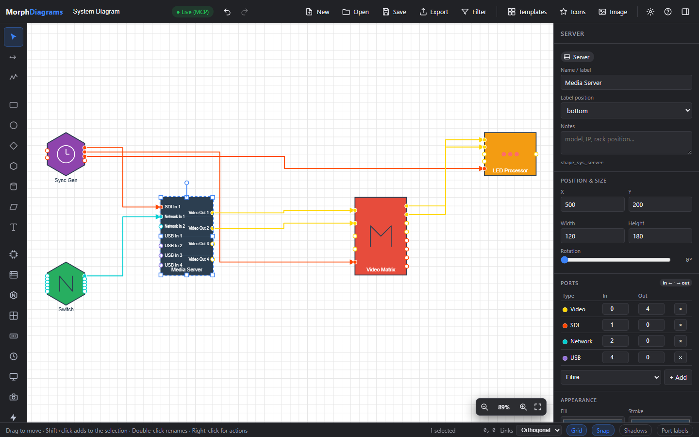
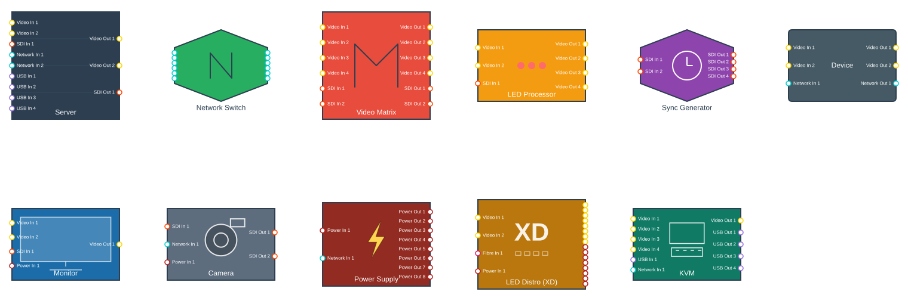
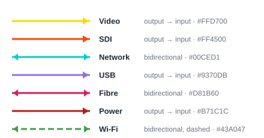
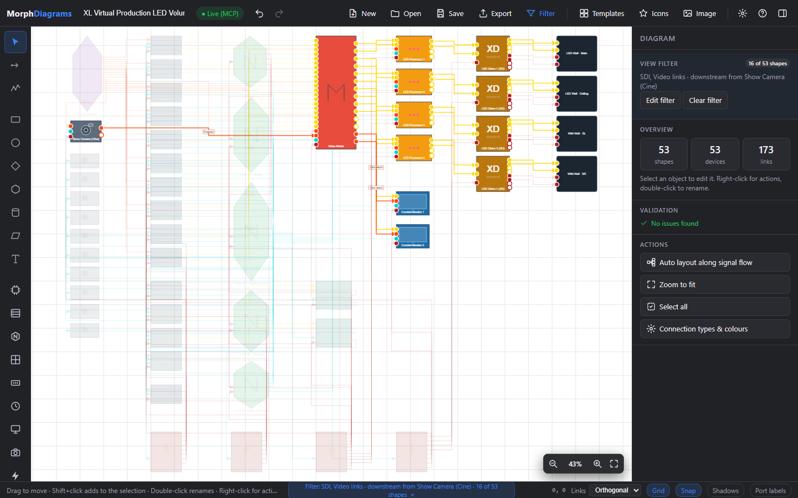
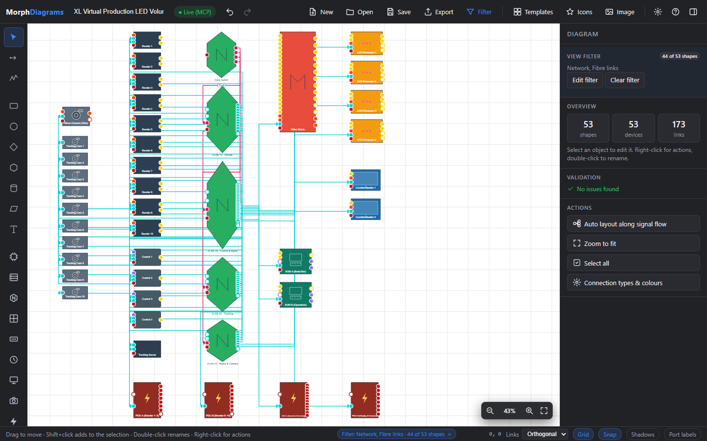
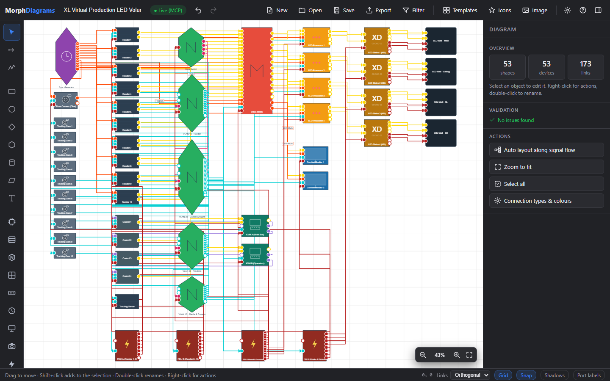

<div align="center">

# Morph Diagrams

**System diagrams for real hardware: devices with typed ports, validated connections, signal-path tracing — and an MCP server so an LLM agent can draw them for you.**

[](https://itzmorphinetime.github.io/MorphDiagrams/)
[](https://itzmorphinetime.github.io/MorphDiagrams/?load=examples/vp-volume.json&view=fit)




</div>

Morph Diagrams is a browser-based diagramming tool built for AV, broadcast, virtual production and IT
systems. Instead of boxes and arrows, you draw **devices with input/output ports of a given signal type**
(video, SDI, network, USB, fibre, power, Wi-Fi, or your own). Connections only snap to compatible ports,
every link keeps its type and colour, and the diagram knows what feeds what — so you can trace a signal,
filter a 200-link stage down to its power distribution, or let an AI agent build the whole thing from a
description.

No framework, no build step: plain HTML, ES modules and a `<canvas>`. Open [`index.html`](index.html) or the
[live demo](https://itzmorphinetime.github.io/MorphDiagrams/) and start drawing.

---

## Contents

- [Highlights](#highlights)
- [Quick start](#quick-start)
- [Devices and ports](#devices-and-ports)
- [Connection types](#connection-types)
- [Reading large diagrams: filter and trace](#reading-large-diagrams-filter-and-trace)
- [Templates and examples](#templates-and-examples)
- [Build diagrams with an LLM agent (MCP)](#build-diagrams-with-an-llm-agent-mcp)
- [Shareable view links](#shareable-view-links)
- [File format](#file-format)
- [Keyboard shortcuts](#keyboard-shortcuts)
- [Architecture](#architecture)
- [Development](#development)
- [Roadmap](#roadmap)
- [License](#license)

---

## Highlights

- **Typed ports.** Servers, switches, matrices, LED processors, cameras, PDUs, KVMs and a generic *Device*
  with any port map you like. Inputs on the left, outputs on the right, hollow dots for free ports.
- **Validated connections.** Links only complete on a compatible port (same signal type, output → input,
  or bidirectional for network-like types). Occupied and dangling ports are flagged.
- **Signal-path tracing and view filters.** Right-click a device to highlight everything downstream or
  upstream; filter by signal type or device type; dim or hide the rest. Exports respect the filter.
- **An MCP server.** Claude (Desktop or Code) or any MCP client can add devices, wire ports, auto-layout,
  validate and render diagrams through 28 tools, while a **live view** shows the result in the browser.
- **Vector output.** True SVG export from the same renderer that draws the canvas; PNG and PDF too.
- **Editor that gets out of the way.** Inline renaming, smart alignment guides, right-click waypoint editing,
  multi-select property editing, undo/redo, autosave with restore, keyboard-first workflow.
- **Ready-made stages.** Templates from a basic flowchart to a complete XL virtual production LED volume
  (53 devices, 173 typed links).

---

## Quick start

### Use it

1. Open the [live demo](https://itzmorphinetime.github.io/MorphDiagrams/) (or `index.html` from any static server).
2. Pick a device from the left palette (hover a button for what it does) and click on the canvas.
3. Double-click it to name it. Adjust its ports in the properties panel.
4. Press **L**, press on a port dot and release on a compatible port of another device.
5. **F** opens the view filter; right-click a device to trace its signal path; `?` lists every shortcut.
6. **Save** writes a JSON file you can reopen, share, or hand to the MCP server. **Export** gives PNG, SVG or PDF.

### Run it locally

```bash
git clone https://github.com/itzmorphinetime/MorphDiagrams.git
cd MorphDiagrams
npm install        # only needed for the MCP server, the live view and the tests
npm run serve      # editor + live bridge at http://127.0.0.1:8765/
npm test           # model + MCP tests
```

The editor itself has no dependencies — any static file server (or opening `index.html`) works.

---

## Devices and ports

Every system object carries a **port map**, for example `{ "video": { "input": 2, "output": 4 }, "sdi": { "input": 1, "output": 0 } }`.
Each port becomes a typed anchor named `<type>_<direction>_<index>` (`video_output_0`, `sdi_input_2`, …),
laid out evenly along the left (inputs) and right (outputs) edges. Port counts and types are editable per
device in the properties panel, so a "Server" can just as well be a media server with 8 outputs or a router
with 32 SDI inputs.

<div align="center"></div>

| Device | Default ports | Typical use |
|---|---|---|
| **Device** | video 2/2, network 1/1 | Any hardware without a dedicated shape — change the port map freely |
| **Server** | video 2/2, SDI 1/1, network 2 in, USB 4 in | Media / render servers, workstations |
| **Network Switch** | network 6/6 (bidirectional) | Core and VLAN switches |
| **Video Matrix** | video 4/4, SDI 2/2 | Routers and matrices |
| **LED Processor** | video 2 in / 4 out, SDI 1 in | LED wall processing |
| **Sync Generator** | SDI 2 in / 4 out | Genlock / reference distribution |
| **Monitor** | video 2 in / 1 loop-out, SDI 1 in, power in | Displays and comfort monitors |
| **Camera** | SDI 1 in (genlock) / 2 out, network in, power in | Show and tracking cameras |
| **Power Supply** | power 1 in / 8 out, network in | PDUs and supplies |
| **LED Distro (XD)** | video 2 in / 8 out, fibre in, power 1 in / 8 out | LED data and power distribution |
| **KVM** | video 4 in / 1 out, USB 1 in / 4 out, network in | KVM switches and extenders |
| **Connector Anchor** | one universal port | Junctions, patch points, "to be defined" ends |

Basic shapes (rectangle, circle, diamond, hexagon, cylinder, parallelogram, text, image) are also available
for annotations and generic flowcharts; they expose untyped anchors on their four sides.

---

## Connection types

<div align="center"></div>

- **Video, SDI, USB, Power** run from an output to an input. **Network, Fibre and Wi-Fi** are
  bidirectional, and Wi-Fi links are drawn dashed.
- Add your own types (HDMI, Dante, DMX, MADI, …) in *Settings*. Custom types are stored inside the diagram
  file, so they travel with it and the MCP server sees them too.
- A link drawn from an untyped anchor adopts the type of the port it lands on. Colours can be changed per
  type in *Settings*; each connector can still be recoloured individually.

---

## Reading large diagrams: filter and trace

Big stages get busy. The **Filter** popover (`F`) narrows the view to one or more signal types, one or more
device types, or the signal path from the selected devices — everything else is dimmed, or hidden entirely.
Right-clicking a device offers *Trace downstream* (what it feeds) and *Trace upstream* (what feeds it);
right-clicking a link offers *Show only SDI links* and friends. `Esc` clears the filter, and the SVG export
honours it, so a "power distribution only" drawing is one click away.

Tracing follows real port directions and treats network-like links as connections rather than paths: a
switch is reached, but the trace does not leak through it into the whole network unless you ask for that.

<div align="center">


</div>

---

## Templates and examples

*Templates* inserts a ready-made diagram as a group. Besides the classic flowchart, three-tier architecture,
network diagram and org chart, two system templates show the port model at work:

- **System Diagram** — sync generator, server, video matrix, LED processor and switch with eight typed links.
- **XL Virtual Production LED Volume** — a complete stage: 10 genlocked render servers (2 outputs each)
  into a 20×12 video matrix, 4 LED processors → 4 LED distros → 4 wall sections with data and power, a core
  switch with 4 separated VLANs (render, tracking, control/management, media & camera), 4 control machines
  on 2 KVMs, 10 PoE tracking cameras and a tracking server, a genlocked show camera, 2 comfort monitors and
  4 PDUs. 53 devices, 173 validated links.

<div align="center"></div>

The same diagrams are available as files in [`examples/`](examples/) and as vector renderings in
[`docs/images/`](docs/images/) ([vp-volume.svg](docs/images/vp-volume.svg),
[power distribution only](docs/images/vp-volume-power-filter.svg),
[camera signal path](docs/images/vp-volume-camera-trace.svg)). Open them directly in the live demo:
[XL VP volume](https://itzmorphinetime.github.io/MorphDiagrams/?load=examples/vp-volume.json&view=fit) ·
[system diagram](https://itzmorphinetime.github.io/MorphDiagrams/?load=examples/system-diagram.json&view=fit).

---

## Build diagrams with an LLM agent (MCP)

The repository ships a [Model Context Protocol](https://modelcontextprotocol.io) server that exposes the
diagram model to AI agents. It reuses the editor's own code, so anything the agent produces loads pixel for
pixel in the browser — and while the server runs, the editor at <http://127.0.0.1:8765/> follows every
change live (the green **● Live (MCP)** pill). Edits you make by hand are pushed back to the agent.

```bash
npm install
npm run mcp                 # stdio MCP server + live view
```

**Claude Code**

```bash
claude mcp add morph-diagrams -- node /absolute/path/to/MorphDiagrams/mcp/server.js
```

**Claude Desktop** (`claude_desktop_config.json`)

```json
{
  "mcpServers": {
    "morph-diagrams": {
      "command": "node",
      "args": ["C:/path/to/MorphDiagrams/mcp/server.js"],
      "env": { "MORPH_DIAGRAM_DIR": "C:/path/to/MorphDiagrams/diagrams" }
    }
  }
}
```

Then ask for what you need:

> Build a diagram of two cameras and a graphics server feeding a video switcher, program out to a
> recorder and a multiviewer, genlock from a sync generator, everything on one switch. Save it as
> `studio-b.json` and render an SVG.

The agent works through tools such as `add_device`, `connect` / `connect_many` (ports are picked
automatically from a type like `"sdi"` or `"sdi_output"`), `set_port_count`, `auto_layout`,
`validate_diagram`, `trace_signal_path`, `render_svg`, `save_diagram` and `undo`, and reads the file
format schema and catalogues as resources. Every mutation is validated with agent-friendly errors (for
example the list of free ports when a requested one is occupied). Full setup, environment variables and the
tool reference: [mcp/README.md](mcp/README.md).

---

## Shareable view links

View state can be expressed in the URL, which makes it easy to link to a specific view of an example or to
script screenshots:

| Parameter | Effect |
|---|---|
| `?load=examples/vp-volume.json` | Load a diagram file (same origin or CORS-enabled) |
| `?view=fit` / `?zoom=0.5` | Zoom to fit / set a zoom level |
| `?select=vp_render_1,vp_render_2` | Select objects by id |
| `?filter=sdi,video` / `?devices=camera,kvm` | Filter by signal or device type |
| `?trace=vp_show_cam:downstream` | Trace a signal path (`downstream`, `upstream` or `both`) |
| `?hide=1` / `?labels=1` | Hide filtered objects instead of dimming / show port labels |

---

## File format

Diagrams are plain JSON (format 2.1, schema in [`schema/diagram.schema.json`](schema/diagram.schema.json)).
Connectors reference shapes by id and ports by anchor key, custom connection types are embedded, and older
1.0/2.0 files still load.

```json
{
  "version": "2.1",
  "objects": [
    { "id": "srv1", "type": "server", "label": "Media Server", "x": 100, "y": 100, "width": 120, "height": 180,
      "ports": { "video": { "input": 0, "output": 2 }, "network": { "input": 1, "output": 0 } } },
    { "id": "led1", "type": "led_processor", "label": "LED Processor", "x": 400, "y": 120, "width": 150, "height": 110,
      "ports": { "video": { "input": 2, "output": 4 } } },
    { "id": "c1", "type": "connector", "startObject": "srv1", "startAnchor": "video_output_0",
      "endObject": "led1", "endAnchor": "video_input_0", "connectionType": "video", "style": "orthogonal", "label": "PGM" }
  ],
  "connectionTypes": { "dante": { "label": "Dante", "color": "#3F51B5", "bidirectional": true } },
  "metadata": { "name": "Stage A" }
}
```

---

## Keyboard shortcuts

| Keys | Action |
|---|---|
| `V` `L` `P` | Select · Connector · Polyline connector |
| `R` `C` `D` `H` `T` `E` | Rectangle · Circle · Diamond · Hexagon · Text · Generic device |
| `F2` / `Enter` / double-click | Rename or edit text in place |
| `F` | Filter view · `Esc` clears the filter, cancels a link, deselects |
| `Ctrl+Z` / `Ctrl+Y` | Undo / redo |
| `Ctrl+C` `V` `X` `D` | Copy · Paste · Cut · Duplicate (connections between copied devices are kept) |
| `Ctrl+A` · `Ctrl+G` · `Ctrl+Shift+G` | Select all · Group · Ungroup |
| `Del` | Delete (links of deleted devices go too) |
| Arrows / `Shift`+Arrows | Nudge by 1 px / one grid step |
| `[` `]` `Shift+[` `Shift+]` | Layer backward / forward / to back / to front |
| Wheel · `Space`+drag · `Ctrl+0` · `Shift+1` | Zoom at cursor · Pan · Reset zoom · Zoom to fit |
| Right-click a link | Add / remove waypoints, straighten, change path style, reverse, edit label |
| `Alt`+click a waypoint · `Alt`+drag marquee | Remove the waypoint · Select everything the box touches |
| `Ctrl+S` / `Ctrl+O` | Save / open JSON |
| `?` | Shortcut help |

---

## Architecture

```
index.html, styles2.css          Editor page and styles
js/main.js                       CanvasApp: input, rendering, filters, live sync
js/ui/                           PropertiesPanel, ContextMenu, Tooltip, Dialogs, LiveSync
js/core/
  BaseShape.js, SystemObject.js  Geometry, labels, typed ports
  Connector.js, Ports.js         Routing, waypoints, port keys and compatibility rules
  ShapeRegistry.js               Catalogue of shape types
  Diagram.js                     Headless model: connect, validate, trace, filter, auto-layout
  Serialization.js               JSON file format (v2.1)
  SvgExporter.js, SmartGuides.js Vector rendering, alignment guides
js/shapes/                       Rectangle … Device, Server, Camera, KVM, …
js/config/ConnectionTypes.js     Connection type registry
mcp/server.js, mcp/http-bridge.js  MCP server and live view bridge
schema/diagram.schema.json       File format schema (also an MCP resource)
examples/                        Example diagrams
test/                            node --test suites (model, editing, devices, templates, MCP end to end)
scripts/                         API docs and README image generation
```

The model layer (`js/core`) has no DOM dependency: the editor, the MCP server and the tests all use the same
code for ports, connections, validation and rendering to SVG.

---

## Development

```bash
npm test                          # 30 tests: model, editing, devices/filters, templates, MCP over stdio
npm run docs:api                  # regenerate docs/api from JSDoc (GitBook layout in docs/)
node scripts/build-readme-images.mjs   # rebuild docs/images and examples (screenshots need Chrome or Edge)
```

Contributions are welcome — [IMPROVEMENTS.md](IMPROVEMENTS.md) holds the assessment, what has been done
and the prioritised backlog, and [docs/](docs/) has the getting-started guide and the API reference.

---

## Roadmap

Highlights from the [backlog](IMPROVEMENTS.md#3-suggested-improvements-not-yet-implemented):

- Per-port names and sides, cable metadata and a **cable schedule export**
- Obstacle-avoiding routing and channel spacing for parallel links
- **Vector PDF**, export of the current selection, image previews for vision-capable agents
- Crossing-minimising auto-layout, CI, TypeScript types for the model

---

## License

Apache 2.0 — see [LICENSE](LICENSE).
